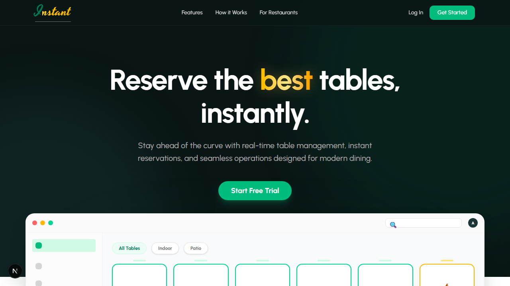

# Instant Restro Platform



A Next.js (App Router) starter application for restaurant booking and management — built to be extended.

## Overview

Instant Restro Platform is a modern web app scaffold using Next.js, TypeScript and React. It includes authentication scaffolding, admin and customer dashboards, restaurant pages, booking flows, and common UI components to help you build a restaurant reservation platform quickly.

## Key Features

- Admin and restaurant dashboards
- Customer booking flow and profile pages
- Restaurant discovery and search
- Reusable UI components and layout system
- Firebase integration utilities (authentication + Firestore helpers)

## Tech Stack

- Next.js (App Router)
- React + TypeScript
- Tailwind / PostCSS (project includes PostCSS config)
- Firebase (auth + Firestore helpers in `src/lib`)

## Quickstart

Install dependencies and run the dev server:

```bash
npm install
npm run dev
```

Open http://localhost:3000 in your browser. Edit files under `src/app` — the app reloads automatically.

Common scripts (available in `package.json`):

- `dev` — run development server
- `build` — build for production
- `start` — run production build

## Environment

Create a `.env.local` file for local secrets (do not commit it). Typical variables:

- `NEXT_PUBLIC_FIREBASE_API_KEY`
- `NEXT_PUBLIC_FIREBASE_AUTH_DOMAIN`
- `NEXT_PUBLIC_FIREBASE_PROJECT_ID`

Refer to `src/lib/firebase.ts` for required keys.

## Project Structure (important folders)

- `src/app` — Next.js App Router pages and layouts
- `src/components` — UI components and dashboard widgets
- `src/lib` — Firebase helpers and utilities
- `src/context` — React contexts (auth)
- `src/hooks` — custom hooks

## Development notes

- The app uses the App Router; pages live in `src/app` and use server and client components where appropriate.
- Keep UI components small and reusable; prefer prop-driven components in `src/components/ui`.

## Contributing

Contributions are welcome. Typical workflow:

1. Fork the repo
2. Create a feature branch
3. Open a pull request with a clear description

Please include a short note about the change and any setup steps needed to test it.

## Deploy

This project is deploy-ready for Vercel. For other platforms, build with:

```bash
npm run build
npm start
```

## License

Specify a license for your project (e.g., MIT) or add one to the repository.

---

If you'd like, I can also:

- add a `CONTRIBUTING.md` and `CODE_OF_CONDUCT.md`
- extract a minimal `.env.example`
- add badges (build, license, coverage) to the top of this README

Tell me which of these you'd like next.
